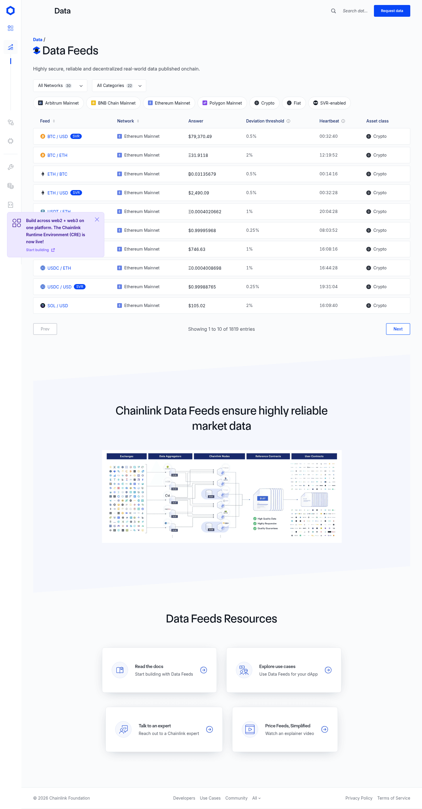
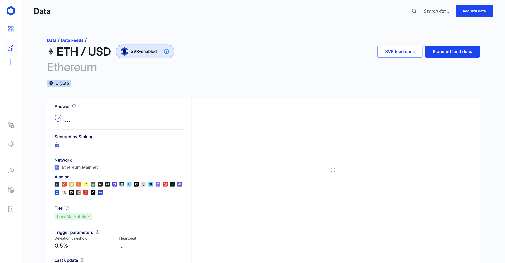

# DESIGN.md: data.chain.link (Chainlink Data Feeds)

## Source
- URL: `https://data.chain.link/`, `/feeds`, `/feeds/ethereum/mainnet/eth-usd`
- Riset v1 (2026-09-07): Firecrawl `branding` + `markdown` + `summary` (confidence warna 0.9, tombol 0.2)
- Riset v2 (2026-09-08, browser-use tab `10CEEE4A…`): computed style + 314 CSS vars `:root` + screenshot detail. Nilai v2 berstatus **measured** (dari `getComputedStyle`/stylesheet, sumber terkuat) dan OVERRIDE nilai v1 yang konflik.
- Catatan: situs dilindungi Vercel Security Checkpoint (lolos setelah 1x tunggu + reload); app memakai inner-scroll container (`overflow-y`), bukan window scroll.
- Sisa label **inferred** = aproksimasi visual, toleransi ±2px.

> Catatan hak: yang ditiru = pola layout, skala, dan token generik. Jangan menyalin logo heksagon, ikon network/token, ilustrasi, foto, atau copy milik Chainlink.

## Reference Screenshot



## Design Summary
Light-only (`colorScheme: light`, tanpa dark mode). Background konten **abu sangat muda** (`gray-50 #FAFBFC`), kartu/baris **putih**, teks utama abu tua (`gray-600 #4E5560` — ya, body text BUKAN hitam), satu biru brand (`blue-700 #0847F7`) yang dipakai hemat. Border selalu 1px `gray-200 #E4E8ED`. Radius sistem: **4px kontrol, 8px kartu**. Heading display `TASAOrbiterDisplay`, body `Inter`, kode `Fira Code`. Tabel = baris kartu tersegmentasi (border atas-bawah per sel + radius ujung 4px). Hierarki angka besar untuk harga, label kecil navy semibold untuk metadata.

## Design Tokens (measured dari `:root`, 314 vars)

### Colors — palet eksak
```
gray:   50 #FAFBFC | 100 #F5F7FA | 200 #E4E8ED | 300 #D1D6DE | 400 #9FA7B2
        500 #6C7585 | 600 #4E5560 | 700 #3C414C | 800 #212732 | 900 #141921 | 950 #0E1119
blue:   50 #EFF6FF | 100 #DCEBFF | 200 #C1DBFF | 300 #97C1FF | 400 #639CFF
        500 #2E7BFF | 600 #0D5DFF | 700 #0847F7 (brand) | 800 #0036C9 | 900 #00299A | 950 #001A62
green:  50 #F1FCF5 | 100 #DDF8E6 | … | 600 #30A059 | 700 #267E46 (badge Tier)
red:    500 #EF4444 | 600 #DC2626 (error)
orange: 500 #E86832 … | yellow: 400 #F9C424 … (warning)
purple: 100 #EDE8FF (wash banner) | 600 #6838E0 …
```

| Role | Token | Status |
|---|---|---|
| Background konten (`main`) | `gray-50 #FAFBFC` | measured |
| Kartu / baris / popover | `#FFFFFF` | measured |
| Teks body (`--color-text-primary`) | `gray-600 #4E5560` | measured |
| Teks sekunder / heading tabel | `gray-700 #3C414C`–`gray-600` | measured |
| Ink (H1, angka) | `gray-900 #141921` | measured |
| Brand / link / primer | `blue-700 #0847F7` | measured |
| Border kartu/baris (`--color-border-primary`) | `gray-200 #E4E8ED` | measured |
| Border tombol outline | `blue-400 #639CFF` (2px) | measured |
| Focus ring (`--border-interactive-focus`) | `4px blue-600 #0D5DFF` | measured |
| Wash banner / chip ikon | `purple-100 #EDE8FF` / `blue-100 #DCEBFF` | measured |
| Badge kategori (Crypto) | `blue-100` bg + teks ink | measured (screenshot) |
| Badge Tier (Low Market Risk) | `green-100` bg + `green-700` teks | measured (screenshot) |
| Strip nav aktif | `blue-700`, 2–3px | measured (screenshot) |

### Typography (measured)
- Body: `Inter, Arial, "Helvetica Neue", Helvetica, sans-serif` — **16px/400**, warna `gray-600`
- Heading: `TASAOrbiterDisplay, Arial, ...` via utilitas `font-display`
- Kode: `Fira Code, Courier New, monospace`
- Berat sistem: `400 / 500 / 700` (tidak ada 600 — yang terlihat "semibold" = 500/700)
- Skala terukur: hero H1 `48px/500` centered (`text-6xl leading-10 text-center font-medium`); H1 feeds `40px/500`; H2 produk `36px/600` putih (`text-5xl`); H2 section detail `32px/500`; subtitle detail ("Ethereum") ~40px abu muda (inferred `#9FA7B2`); TH tabel `16px/700 gray-600`; sel `16px/400`; link feed `16px #0847F7`; chip `14px/400`; tombol primer `12px/600`; badge SVR `12px/400`
- Angka harga/heartbeat: `tabular-nums` (wajib agar rata)

### Spacing, Radius, Border, Shadow (measured)
- Skala spasi: basis **4px** → `4 8 12 16 20 24 32 40 48 64 80 96`
- Radius sistem: `--border-radius-primary: 4px`, `--border-radius-secondary: 8px`, `--border-radius-round: 50%`. Terukur: tombol primer/kartu produk/pagination **4px**; kartu produk `rounded-lg` **8px**; chips/SVR/first-td **24px** (pill praktis)
- Border: `--border-width-primary: 1px`, `secondary: 2px`; warna default `gray-200`
- Shadow: kontrol/baris `none`; kartu elevasi memakai token lapis (`--shadow-mid: 0px 8px 24px -16px #0C162C52` dst.)
- Ukuran terukur: header `74px` (`min-h-[74px]`, padding `16px 40px`, `fixed`, bg nyaris transparan + blur); `main` bg `gray-50`, `padding-top 48px`; tombol primer `124×40`, padding `12px 24px`; chip `padding 12px 16px`, h43; tombol outline `padding 8px 24px`, h40; baris tabel h56; sel `padding 15px 12px 15px 24px`; TH `padding 8px 12px 8px 24px`; badge SVR `padding 1px 8px`, h18; kartu produk `max-w-[408px]` (408×507)

## Layout Blueprint (per halaman, untuk klon 100%)

### Shell global
`[icon rail kiri ~88px, putih, border kanan] [kolom: topbar 74px + main gray-50]`. Rail = ikon outline vertikal, item aktif = strip biru kiri + ikon biru. Topbar: brand/teks kiri ("Data" bold), kanan search + tombol primer. (Catatan: homepage tidak me-render `aside` — rail feeds/detail berupa div biasa.)

### Homepage `/`
Hero centered: H1 display 48px + subtitle abu + CTA. Di bawah: 3 kartu produk (`max-w-408px`, putih, border, radius 8, `overflow-hidden`): area visual gelap atas (H2 display 36px putih + checklist) + area konten bawah (`flex flex-col justify-end gap-2`) + deretan ikon network. Lalu band wash + footer link farm.

### Feeds `/feeds`
Breadcrumb biru (`Data /`) → H1 40px + subtitle → 2 dropdown filter (putih, border, radius ~6px) → chips pill (border 1px, radius 24, ikon kiri) → **tabel full-width**: header tanpa bg (teks gray-600 bold) → baris tersegmentasi (sel putih, border-y 1px, radius ujung 4px, h56) → kolom Feed(link biru + ikon token + badge SVR) | Network | Answer (tabular) | Deviation | Heartbeat | Asset class → pagination (Prev disabled / "Showing 1 to 10 of …" / Next outline 2px biru). Lalu band infografis + resource cards 2×2 + footer.

### Detail feed `/feeds/[network]/[pair]`
Breadcrumb → baris judul: H1 40px + pill `SVR-enabled` (bg biru muda, radius full, ikon + info) … kanan 2 tombol (outline + solid) → subtitle abu besar (nama network) → badge kategori (bg biru muda, radius kecil) → **kartu info 2 kolom** (putih, border, radius 8): kiri ~470px deretan field (label navy semibold kecil + value, separator 1px antar-baris: Answer, Secured by Staking, Network + ikon, Also on [grid ikon], Tier [badge hijau], Trigger parameters [2 kolom: Deviation threshold | Heartbeat], Last update); kanan area chart + legenda + rentang waktu.

## Components (koreksi v2 — semua measured)
- **Primer** (`Request data`, `Standard feed docs`): `inline-flex items-center justify-center gap-2 whitespace-nowrap rounded`, bg `#0847F7`, putih `12px/600`, padding `12px 24px`, radius **4px**, tanpa shadow
- **Outline** (`SVR feed docs`, `Next`): bg putih, teks `#0847F7` `14px/500`, **border 2px `#639CFF`**, radius **4px**, padding `8px 24px`
- **Chip filter**: `filterButton-module…`, putih, border 1px `#E4E8ED`, radius **24px**, `14px/400` ink, padding `12px 16px`, ikon network kiri
- **Badge SVR**: `ml-2 rounded-3xl bg-blue-700 px-2 py-[1px] text-xs text-white` — putih `12px/400`, radius 24, padding `1px 8px`
- **Pill SVR-enabled**: bg biru muda + border, radius full, ikon heksagon + info
- **Search**: teks trigger abu + ikon kaca pembesar (di topbar, tanpa kotak penuh)
- **Tabel**: `table.table`; TH `16px/700`; TD putih border-y + radius ujung; hover row (`highlight-row on-row-click`)

## Content Style
Voice profesional-faktual, kalimat pendek. H1 = nama objek (`Data Feeds`, `ETH / USD`). Label metadata kecil navy (`Answer`, `Network`, `Tier`, `Heartbeat`, `Deviation threshold`). CTA: `Request data`, `SVR feed docs`, `Standard feed docs`, `Read the docs`.

## Agent Build Instructions
Target: Next.js 16 + React 19 + Tailwind v4 + shadcn (lihat `package.json`, `components.json`).

1. Token Tailwind (nilai measured — pakai persis):
   ```css
   @theme {
     --color-brand: #0847F7;
     --color-ink: #141921;
     --color-body: #4E5560;      /* teks utama! bukan hitam */
     --color-page: #FAFBFC;      /* bg main */
     --color-line: #E4E8ED;      /* border */
     --color-outline-blue: #639CFF;
     --color-wash: #EDE8FF;
     --color-wash-blue: #DCEBFF;
     --font-sans: "Inter", Arial, "Helvetica Neue", sans-serif;
     --font-display: "TASAOrbiterDisplay", ...; /* ganti font display bebas-lisensi */
     --font-mono: "Fira Code", ...;
   }
   ```
   Radius: kontrol `rounded` (4px), kartu `rounded-lg` (8px), pill `rounded-3xl`/full.
2. Pola wajib: shell rail + topbar-74 + main gray-50; H1 display; tabel card-rows (border-y per sel, `tabular-nums`); tombol primer 12px/600 radius-4; badge SVR persis kelas di atas; focus ring 4px `#0D5DFF`.
3. Dilarang menyalin aset Chainlink (logo, ikon network/token, ilustrasi, copy). Teks dan ikon dibuat sendiri dengan gaya yang sama.
4. Copy kita mengikuti pola label di atas, bukan kalimat mereka.

## Rerun Inputs
workflow: browser-use deep research (tab khusus, computed style + :root vars + screenshot)
source_urls: https://data.chain.link/ , /feeds , /feeds/ethereum/mainnet/eth-usd
target_stack: Next.js 16 + React 19 + Tailwind CSS v4 + shadcn + TypeScript
output: docs/DESIGN-data-chainlink.md (+ ./assets/chainlink-feed-detail.png)
evidence: 314 CSS vars, getComputedStyle per komponen, 2 screenshot
