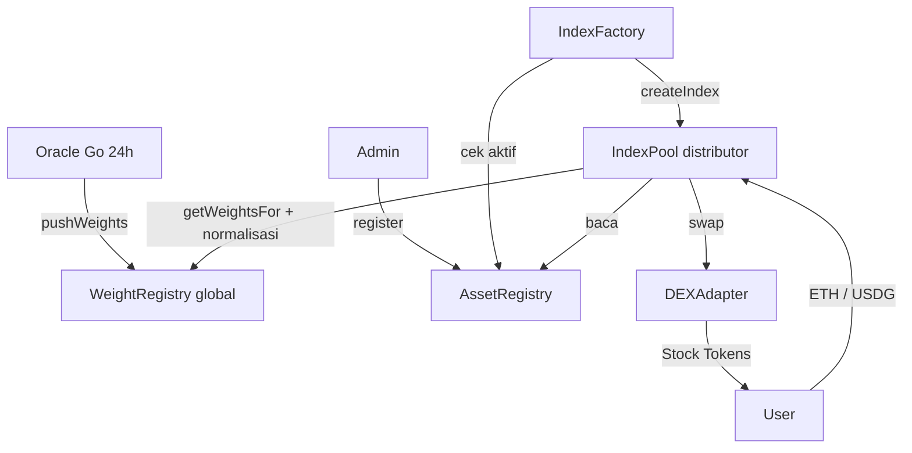
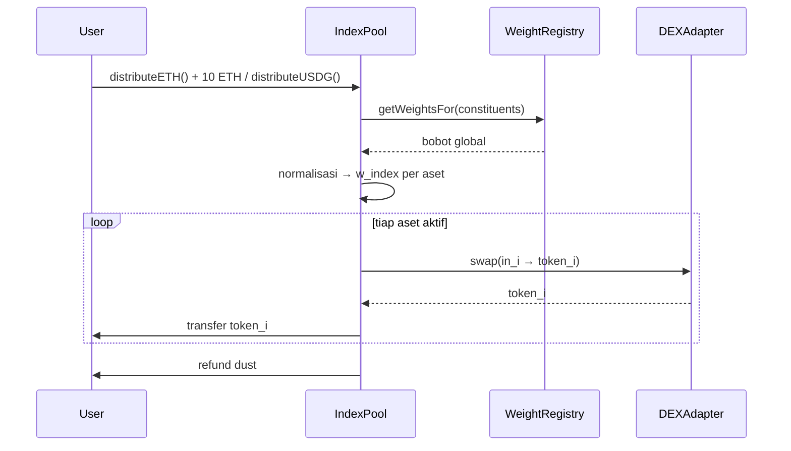

# Spec: eIndex — Registry, WeightRegistry, Factory, Pool (Distributor)

- **Tanggal:** 2026-09-06
- **Status:** Final brainstorming, siap jadi acuan kode
- **Keputusan terkunci:**
  - Pool = distributor (router). User deposit sekali, **user langsung pegang aset ril** (Stock Token RHJ), bukan unit index.
  - `AssetRegistry`: token + feed saja.
  - `WeightRegistry`: **global per aset** (1 ranking dipakai semua index) — paling hemat gas untuk oracle Go.
  - `IndexFactory` input: nama + daftar aset (bobot ikut WeightRegistry).
  - Deposit: **ETH + USDG** (dua entry point).
  - Normalisasi global → per-index: **on-chain saat distribute** (trustless).
- **Dokumen terkait:** `docs/SPEC-RWA-DISTRIBUTOR.md` (konsep split), `docs/SPEC-MAG7.md` (konteks RHJ/Chainlink)

---

## 1. Arsitektur (4 kontrak)

```text
AssetRegistry  → daftar aset yang boleh masuk index mana pun
WeightRegistry → ranking/bobot volume global per aset, update 24 jam oleh oracle Go
IndexFactory   → buat index baru (nama + daftar aset) → deploy IndexPool
IndexPool      → distributor per index (split ETH/USD G → swap → kirim aset ke user)
     ↳ DEXAdapter (Uniswap / Rialto / 0x), FeeCollector opsional
```



---

## 2. `AssetRegistry` — token + feed saja

```solidity
struct Asset { address token; address feed; bool active; }
mapping(address token => Asset) public assets;
address[] public allAssets;
```

- `register(token, feed)` — hanya `REGISTRAR_ROLE`. Tolak: token 0, feed 0, sudah terdaftar. Append `allAssets`.
- `setActive(token, bool)`, `updateFeed(token, feed)` — hanya admin/registrar.
- Event: `AssetRegistered(token, feed)`, `AssetActiveSet(token, active)`, `AssetFeedUpdated(token, feed)`.
- View: `isActive(token)`, `getFeed(token)`, `getAllAssets()`.

---

## 3. `WeightRegistry` — global per aset

```solidity
uint64 public epoch;
uint64 public lastUpdateAt;
mapping(address token => uint16 weightBps) public weights; // sum global = 10000
```

- `pushWeights(epochId, tokens[], weightsBps[])` — hanya `UPDATER_ROLE` (oracle Go / multisig).
  Validasi: `tokens.length == weights.length`, sum == 10000, tiap token registered + aktif, `epochId > epoch`, `tokens` sorted desc (`weights[i] >= weights[i+1]` agar konsisten dengan ranking).
- `getWeightsFor(tokens[]) → uint16[]` — batch read, 1 call untuk N aset (hemat RPC + gas dibanding N call).
- Event: `WeightsUpdated(epochId, tokens, weights, timestamp)`.
- Guard baca di pool: tolak jika `epoch < minEpoch` atau `now - lastUpdateAt > 26 jam`.

Kenapa global (bukan per indexId): oracle tulis **1 tx, N SSTORE** per hari (N = total aset, misal 20). Skema per-index butuh M×K write (M = jumlah index) dan meledak saat index bertambah. Normalisasi ke scope tiap index dilakukan on-chain di pool saat distribute (di-memory, tanpa SSTORE tambahan).

---

## 4. `IndexFactory` — nama + daftar aset

```solidity
uint256 public nextIndexId;
mapping(uint256 indexId => address pool) public pools;
mapping(uint256 => address[]) public constituents;
```

- `createIndex(name, symbol, constituents[]) → (indexId, pool)`:
  1. `constituents.length >= 2`, tidak ada duplikat / alamat 0.
  2. Tiap aset wajib `AssetRegistry.isActive()`.
  3. Deploy `IndexPool` baru (MVP: deploy biasa; optimasi: EIP-1167 clone).
  4. `pool.initialize(factory, assetRegistry, weightRegistry, dexAdapter, feeTo, feeBps, constituents, name, symbol)`.
  5. Simpan + emit `IndexCreated(indexId, pool, name, symbol, constituents)`.

---

## 5. `IndexPool` — distributor (satu per index)

Storage: `constituents[]` (copy saat create), referensi registry, `dexAdapter`, `feeTo`, `feeBps` (misal 20 = 0,2%, cap 50).

### 5.1 Fungsi

```solidity
function distributeETH(uint64 minEpoch, bytes[] calldata swapData, uint256[] calldata minOut, address[] calldata skipTokens, uint256 deadline)
  external payable returns (uint256[] memory amountsOut);

function distributeUSDG(uint256 usdgAmount, uint64 minEpoch, bytes[] calldata swapData, uint256[] calldata minOut, address[] calldata skipTokens, uint256 deadline)
  external returns (uint256[] memory amountsOut);
```

`distributeUSDG` tarik via `transferFrom` (user approve dulu). Sisanya identik, beda sumber dana (native vs ERC-20).

### 5.2 Alur (sama untuk ETH/USD G)

```text
1. cek deadline, dana > 0, epoch registry >= minEpoch dan tidak basi (>26 jam tolak)
2. w_global[] = WeightRegistry.getWeightsFor(constituents)
3. filter skipTokens (halt) → total = sum(w_global aktif)
4. w_index_i = w_global_i * 10000 / total; sisa rounding → indeks bobot terbesar
5. potong fee → treasury; net = dana - fee
6. loop tiap aset aktif:
     in_i = net * w_index_i / 10000
     skip jika in_i < dust (refund)
     swap via DEXAdapter.swapExactIn(tokenIn, tokenOut, in_i, minOut_i, swapData_i)
     transfer output langsung ke msg.sender
7. refund residu (ETH sisa / USDG sisa) ke user
8. emit Distributed(user, indexId, epoch, tokenIn, net, tokens, amountsOut)
```

### 5.3 Diagram



### 5.4 Guard

Bobot basi, `minOut` per leg, `deadline`, dust threshold, `ReentrancyGuard`, `Pausable`, allowlist venue DEX, `skipTokens` untuk aset halt (1 halt tidak gagalkan semua), refund selalu ke user (CEI).

---

## 6. Oracle Go (off-chain, 1 tx / 24 jam)

```text
cron 24 jam (misal 00:00 UTC):
  assets = AssetRegistry.getAllAssets()
  untuk tiap aset: vol = RHJ GET /prices → dailyTradingVolume
  weight = vol / sum(vol) * 10000 → sort desc → koreksi rounding ke terbesar
  kirim pushWeights(epoch+1, tokens, weights)
monitor: alert jika push telat > 26 jam atau sum != 10000
```

Kunci updater di KMS/multisig. Log perhitungan per epoch untuk audit.

---

## 7. Bisakah volume dihitung on-chain nantinya?

**Jawaban singkat: bisa, tapi tidak penuh dan tidak disarankan sebagai sumber utama.** Alasannya struktural, bukan sekadar biaya:

1. **Volume yang dipakai sekarang itu off-chain.** `dailyTradingVolume` RHJ mencakup primary mint/burn + RFQ + propAMM + orderbook — sebagian besar tidak tercatat sebagai swap on-chain di pool yang bisa kita baca. Volume Nasdaq underlying apalagi, 100% off-chain dan butuh oracle harga/volume (Chainlink feeds standar hanya harga, bukan volume).
2. **Yang bisa dihitung on-chain hanya sebagian kecil.** Tiga pendekatan yang realistis:
   - **a. Transfer tracker** di token wrapper — catat tiap `Transfer` per aset per 24 jam. Menangkap semua perpindahan, tapi termasuk transfer non-trading (airdrop, internal), boros SSTORE, dan Stock Token RHJ tidak bisa dimodifikasi (kontrak milik issuer).
   - **b. Pool hook accumulator** (Uniswap v4 `afterSwap`) — akumulasi `outputAmount` per aset per epoch di kontrak kita. Akurat untuk pool kita sendiri, tapi buta terhadap RFQ/Rialto/Lighter dan rentan wash-trading untuk menggelembungkan bobot sendiri. Plus tiap swap bayar SSTORE tambahan (~2–5k gas) yang dibebankan ke trader.
   - **c. Chainlink Functions / custom oracle** — pada dasarnya tetap off-chain (fetch API volume) yang diverifikasi on-chain. Ini jalan tengah terbaik kalau mau lebih terdesentralisasi dari server Go tunggal.
3. **Rekomendasi:** tetap **Go oracle sebagai source of truth** (murah: 1 tx/hari, lengkap: semua venue). Jalur on-chain hanya sebagai **fallback anti-stale**: jika `lastUpdate > 26 jam`, pool tolak tx (seperti sekarang) ATAU pakai bobot epoch terakhir + bobot hook-akumulator lokal dengan cap deviasi. Jangan jadikan volume on-chain sebagai pengganti sebelum (i) semua likuiditas pindah on-chain dan (ii) ada anti-manipulasi (TWAP volume + cap per-epoch ±500 bps yang sudah ada di desain).

Upgrade path tanpa mengubah factory: tambah `VolumeHook` opsional per pool + `WeightRegistry.useFallback(bool)` — tidak perlu migrasi index yang sudah dibuat.

---

## 8. Parameter awal

| Parameter | Nilai | Ket. |
|---|---|---|
| Epoch | 24 jam, 00:00 UTC | toleransi baca 26 jam |
| Fee distributor | 20 bps (0,2%) | cap 50 bps, ke treasury |
| Dust leg | 0,001 ETH / setara USDG | di bawah itu skip + refund |
| Cap/floor per-index (opsional) | max 3000 / min 500 bps | cegah 1 spike dominan |
| Max deviasi/epoch | ±500 bps | di oracle Go |

---

## 9. Testing

- **Unit** (`*.t.sol`): AssetRegistry (duplikat/0-address), WeightRegistry (sum/monotonik/sort), normalisasi (sum == 10000 pasca-rounding), dust/skip/refund, revert basi/minOut/deadline.
- **Integrasi** (`test/*.ts`, viem): mock registry + mock DEXAdapter; deposit 10 ETH dan X USDG → user terima N token proporsional; fee ke treasury; skip 1 halt token.
