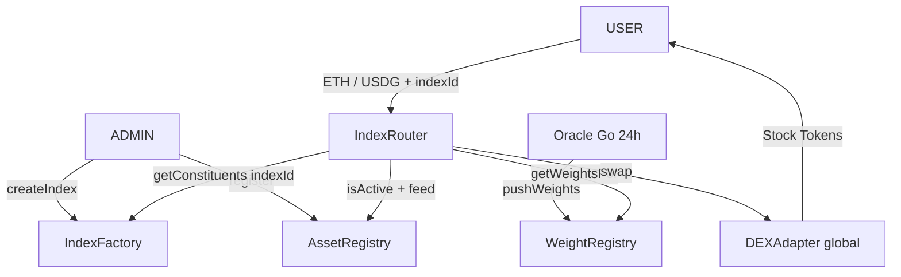
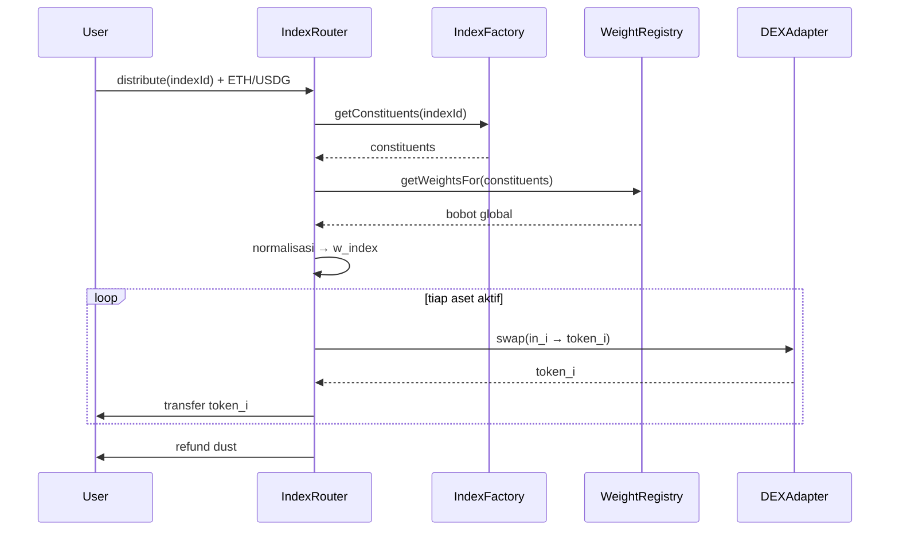

# Spec Final: eIndex Router — Distribute Berbobot Tanpa Pool

- **Tanggal:** 2026-09-06
- **Status:** Desain final, siap jadi acuan kode
- **Keputusan terkunci (brainstorming):**
  - Tidak ada kontrak Pool per index. Daftar index (list aset) disimpan di **Factory**.
  - **Router** stateless: terima deposit (ETH / USDG) → baca index dari Factory on-chain → baca bobot global → split + swap → kirim aset ril ke user.
  - **AssetRegistry**: token + feed saja.
  - **WeightRegistry**: bobot volume global per aset, update 24 jam oleh oracle Go.
  - `name + symbol` index = **label metadata saja** (tanpa ERC-20).
  - Fee treasury + alamat DEX adapter = **global di Router** (satu untuk semua index).
  - Normalisasi global → per-index: **on-chain saat distribute**.
- **Dokumen sebelumnya:** `docs/SPEC-EINDEX-FACTORY.md` (varian pool) digantikan oleh dokumen ini.

---

## 1. Arsitektur (4 kontrak, tanpa pool)

```text
AssetRegistry   — token → {feed, active}
WeightRegistry  — token → weightBps global, epoch, lastUpdateAt (ditulis oracle Go)
IndexFactory    — indexId → {name, symbol, constituents[]} + metadata
IndexRouter     — distributeETH / distributeUSDG (baca Factory + WeightRegistry, swap via DEXAdapter)
     ↳ DEXAdapter (global, Uniswap / Rialto / 0x), feeTo + feeBps (global)
```



---

## 2. `AssetRegistry`

```solidity
struct Asset { address token; address feed; bool active; }
mapping(address token => Asset) public assets;
address[] public allAssets;
```

- `register(token, feed)`, `setActive(token, bool)`, `updateFeed(token, feed)` — `REGISTRAR_ROLE`/admin.
- View: `isActive(token)`, `getFeed(token)`, `getAllAssets()`.
- Event: `AssetRegistered`, `AssetActiveSet`, `AssetFeedUpdated`.

---

## 3. `WeightRegistry` (oracle bobot on-chain)

```solidity
uint64 public epoch;
uint64 public lastUpdateAt;
mapping(address token => uint16 weightBps) public weights; // sum = 10000
```

- `pushWeights(epochId, tokens[], weightsBps[])` — hanya `UPDATER_ROLE` (oracle Go). Validasi: panjang sama, sum == 10000, semua token registered + aktif, `epochId > epoch`, desc (`weights[i] >= weights[i+1]`).
- `getWeightsFor(tokens[]) → uint16[]` — batch read sekali jalan.
- Event: `WeightsUpdated(epochId, tokens, weights, timestamp)`.
- On-chain hanya simpan **bobot + epoch + timestamp**. Volume mentah tidak disimpan (hemat SSTORE, cukup di log off-chain).

---

## 4. `IndexFactory` (penyimpan daftar index)

```solidity
struct Index { string name; string symbol; address[] constituents; bool exists; }
uint256 public nextIndexId;
mapping(uint256 indexId => Index) public indexes;
```

- `createIndex(name, symbol, constituents[]) → indexId` — admin/owner:
  1. `constituents.length >= 2`, tanpa 0-address/duplikat.
  2. Tiap aset wajib `AssetRegistry.isActive()`.
  3. Simpan + emit `IndexCreated(indexId, name, symbol, constituents)`.
- `updateIndex(indexId, constituents[])` — opsional, ganti komposisi (emit `IndexUpdated`). Rekomendasi: boleh, karena tanpa pool tidak ada migrasi dana.
- `deactivateIndex(indexId)` — nonaktifkan tanpa hapus (router tolak index nonaktif).
- View: `getConstituents(indexId)`, `getIndex(indexId)`.
- `symbol` murni label frontend/event, bukan token.

---

## 5. `IndexRouter` (satu-satunya titik deposit)

Storage global: `factory`, `assetRegistry`, `weightRegistry`, `dexAdapter`, `feeTo`, `feeBps` (misal 20 = 0,2%, cap 50), `dustThreshold`.

```solidity
function distributeETH(uint256 indexId, uint64 minEpoch, bytes[] calldata swapData, uint256[] calldata minOut, address[] calldata skipTokens, uint256 deadline)
  external payable returns (uint256[] memory amountsOut);

function distributeUSDG(uint256 indexId, uint256 usdgAmount, uint64 minEpoch, bytes[] calldata swapData, uint256[] calldata minOut, address[] calldata skipTokens, uint256 deadline)
  external returns (uint256[] memory amountsOut);
```

Alur `distribute` (identik, beda sumber dana):

```text
1. cek deadline, dana > 0, index exists + aktif
2. constituents[] = factory.getConstituents(indexId)   // baca on-chain
3. w_global[] = weightRegistry.getWeightsFor(constituents)
   tolak jika epoch < minEpoch atau now - lastUpdate > 26 jam
4. filter skipTokens (aset halt) → total = sum(w_global aktif)
5. w_index_i = w_global_i * 10000 / total; sisa rounding → bobot terbesar
6. fee → feeTo; net = dana - fee
7. loop: in_i = net * w_index_i / 10000
   - skip jika < dust → refund
   - swap via dexAdapter.swapExactIn(tokenIn, tokenOut, in_i, minOut_i, swapData_i)
   - transfer output langsung ke msg.sender (CEI)
8. refund residu ke user; emit Distributed(user, indexId, epoch, tokenIn, net, tokens, amountsOut)
```



Guard: `ReentrancyGuard`, `Pausable`, allowlist venue di adapter, per-leg `minOut`, `skipTokens` agar 1 halt tidak gagalkan semua.

---

## 6. Oracle Go (tetap 1 tx / 24 jam)

```text
cron 00:00 UTC: assets = getAllAssets()
vol_i = RHJ /prices → dailyTradingVolume
weight = vol/sum*10000 → sort desc → koreksi rounding
pushWeights(epoch+1, tokens, weights)
```

Bobot global sekali tulis dipakai semua index; normalisasi per index terjadi di router saat dipakai. Tidak ada biaya oracle per index baru.

---

## 7. Contoh: 10 ETH → index RWA300 (AAPL, NVDA, MSFT)

Bobot global (misal): AAPL 1500, NVDA 2500, MSFT 1800, sisanya milik aset lain di luar index. Total dalam index = 5800 → normalisasi: NVDA 43,1% (4,31 ETH), MSFT 31,0% (3,10 ETH), AAPL 25,9% (2,59 ETH) setelah fee. User terima 3 Stock Token langsung di wallet-nya + refund dust.

---

## 8. Testing

- **Unit** (`*.t.sol`): factory (duplikat/nonaktif), registry (sum/monotonik/sort), router math (normalisasi sum 10000, rounding ke terbesar), dust/skip/refund, revert basi/minOut/deadline/index nonaktif.
- **Integrasi** (`test/*.ts`, viem): mock factory/weight/dex; deposit ETH dan USDG → user terima N token proporsional; fee ke `feeTo`; skip 1 halt token.
