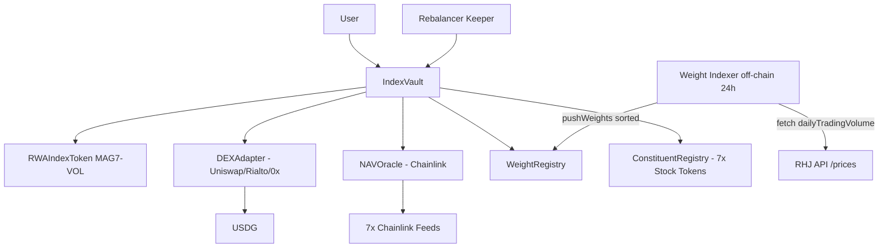
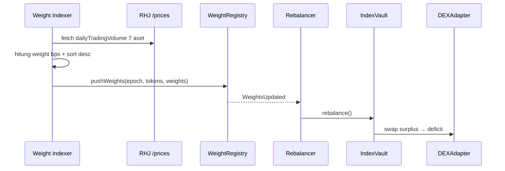
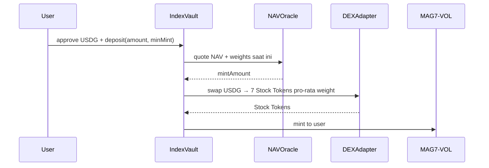

# Spec MVP: MAG7 Volume-Weighted RWA Index (RWA Indexer)

- **Status:** Draft MVP — hasil brainstorming
- **Tanggal:** 2026-09-06
- **Jaringan target:** Robinhood Chain (chainId 4663, Arbitrum Orbit L2, gas ETH)
- **Repo:** `robinwa/contracts` (Hardhat 3 + viem, `node:test`)
- **Keputusan MVP:**
  - Basket: Magnificent 7 (AAPL, MSFT, NVDA, AMZN, META, GOOGL, TSLA — versi Stock Token RHJ)
  - Bobot: volume-weighted off-chain, update 24 jam, disimpan di `WeightRegistry`, dibaca vault (sorted desc)
  - Deposit: USDG only
  - Tahap ini: spec + diagram dulu (belum scaffold kontrak)

---

## 1. Latar: bagaimana Robinhood Chain bekerja

Sumber: Context7 `/websites/robinhood_chain` + scrape `https://docs.robinhood.com/chain/` (diakses 2026-09-06).

- Permissionless, EVM-compatible Layer-2 di atas **Arbitrum Dedicated Blockchains (Orbit)**. Settlement ke Ethereum mainnet (`parentChainId: 1`).
- `chainId: 4663`, gas token **ETH**, sequencing **first-come-first-served** (tanpa prioritas fee) → ordering transparan dan predictable.
- Tooling Ethereum jalan tanpa modifikasi: Solidity/Vyper, Hardhat, Foundry, ethers.js, viem, Wagmi, JSON-RPC standar. Support native **ERC-4337 Account Abstraction** (gas sponsorship, batching, session keys).
- Dioptimasi untuk **RWA**: self-custody, 24/7, programmable.
- Ekosistem resmi: Alchemy (RPC), LayerZero (bridge), Chainlink (oracle), Uniswap (DEX), Rialto (propAMM), Morpho (lending), Lighter/Arcus (perps), USDG Paxos (stablecoin), Fireblocks/BitGo (custody), TRM Labs (compliance).
- Konfigurasi Hardhat (dari docs resmi):

```js
networks: {
  robinhood: {
    url: process.env.RH_RPC_URL,
    chainId: 4663,
    accounts: [process.env.PRIVATE_KEY],
  },
}
```

Verifier: Blockscout `https://robinhoodchain.blockscout.com/api`.

**Implikasi untuk repo ini:** `hardhat.config.ts` saat ini belum punya network `robinhood`. Tinggal tambah network di atas saat masuk fase deploy. Pola test tetap: unit Solidity (`*.t.sol`, forge-std) + integrasi TS (`test/*.ts`, viem, `node:test`).

---

## 2. Latar: bagaimana RHJ / Stock Tokens bekerja

Sumber: `https://docs.robinhood.com/chain/stock-tokens`, `https://docs.robinhood.com/chain/building-with-stock-tokens`, `https://docs.robinhood.com/chain/stock-token-apis`.

**RHJ = Robinhood Assets (Jersey) Limited** (Jersey #162428) — issuer + tokenizer.

- Stock Token = **tokenised debt securities**: memberi *economic exposure* ke saham/ETF US, **tanpa hak legal/beneficial** atas saham underlying.
- Tiap token = **ERC-20 standar, 18 decimals**, 1 ticker = 1 contract (total 190+ token).
- **Backing 1:1** oleh saham asli yang dipegang kustodian US.
- **Primary market tertutup:** hanya Authorised Participant (saat ini cuma BBVI, wajib KYB) yang bisa mint/burn langsung ke RHJ. Developer/retail **hanya via secondary market**.
- **Likuiditas secondary (4 jalur):**
  1. RFQ — 0x RFQ, 1inch Fusion, LiFi (quote signed off-chain).
  2. AMM standar — Uniswap (composable onchain).
  3. propAMM — Rialto (market-maker-backed, composable onchain).
  4. Orderbook — Lighter (spot & perps).
- **Corporate actions via multiplier, bukan rebase (ERC-8056 Scaled UI Amount):**

```text
underlying shares = raw amount × uiMultiplier / 1e18
```

`1e18 = 1.0` saat launch. Dividen → auto-reinvest → `uiMultiplier` naik. Split → multiplier menyesuaikan. Raw `balanceOf()` tetap, yang berubah: `balanceOfUI()`, `totalSupplyUI()`, event `UIMultiplierUpdated` + `TransferWithScaledUI`. Ada juga `newUIMultiplier()` + `effectiveAt()` untuk update yang dijadwalkan.

- **Harga Chainlink sudah termasuk multiplier — jangan dikali dua kali.** Tiap aset punya feed sendiri (`AggregatorV3Interface::latestRoundData()`). Wajib cek `price > 0`, staleness `updatedAt`, sequencer uptime.
- **Offchain REST:** `https://api.robinhood.com/rhj/` → `/assets` (metadata + `currentMultiplier`), `/prices` (bid/ask, `dailyTradingVolume`, `isTradingHalt`), `/corporate-actions`.
- **Compliance warisan:** bukan untuk US persons, Canada, UK, Swiss, dll. Wajib geoblock + tampilkan Base Prospectus dari `docs.robinhood.com/rhj`.
- Validasi ide: docs resmi secara eksplisit menyebut use case **"Indices & baskets: An AI basket (NVDA, MSFT, GOOGL) that auto-values from each token's Chainlink feed"**.

**Contoh baca harga (dari docs resmi):**

```solidity
AggregatorV3Interface feed = AggregatorV3Interface(NVDA_PRICE_FEED);
(, int256 price, , uint256 updatedAt, ) = feed.latestRoundData();
require(price > 0 && updatedAt > 0, "Invalid price");
```

**Contoh hitung nilai holding (dari docs resmi):**

```solidity
function holdingValueUsd(
  IERC20 stockToken,
  AggregatorV3Interface priceFeed,
  address user
) external view returns (uint256) {
  uint256 balance = stockToken.balanceOf(user); // 18 decimals
  (, int256 price, , uint256 updatedAt, ) = priceFeed.latestRoundData();
  require(price > 0 && updatedAt > 0, "Invalid price"); // price: 8 decimals
  return (balance * uint256(price)) / 1e8;
}
```

---

## 3. Definisi produk: MAG7-VOL

**`MAG7-VOL`**: 1 token ERC-20 = keranjang 7 Stock Tokens RHJ (AAPL, MSFT, NVDA, AMZN, META, GOOGL, TSLA). Full-collateral (vault pegang Stock Token asli yang dibeli via secondary), bukan sintetik.

```text
NAV = sum(balance_i × Chainlink_price_i) + USDG_idle
price_per_index_token = NAV / totalSupply
```

User beli 1x (deposit USDG), dapat diversifikasi otomatis. Mirip ETF tapi onchain, fractional, 24/7.

Alamat kontrak 7 Stock Tokens + 7 feed Chainlink diambil dari halaman resmi **Token Contracts** dan **Oracles & Price Feeds** saat implementasi (jangan hardcode dari sumber tidak resmi).

---

## 4. Metodologi bobot volume 24 jam

### 4.1 Sumber volume

- **Primary:** `dailyTradingVolume` dari `GET https://api.robinhood.com/rhj/prices` — paling relevan dengan likuiditas Stock Token itu sendiri.
- **Cross-check / fallback:** volume Nasdaq underlying (opsional, diputuskan saat implementasi indexer).
- Alasan: bobot harus mencerminkan aset yang paling likuid/diminati dalam ekosistem RHJ, bukan sekadar market-cap TradFi yang datanya lebih berat di-oracle-kan.

### 4.2 Rumus (off-chain, tiap epoch 24 jam, misal 00:00 UTC)

```text
v_i       = dailyTradingVolume_i (24h terakhir, per aset terdaftar)
weight_i  = v_i / sum(v) * 10000  (bps)
```

- Dibulatkan ke bps integer, koreksi rounding ke aset terbesar agar `sum == 10000`.
- Sort descending by `weight_i` sebelum push onchain.
- Guard yang diusulkan: max 30%/aset (cap), min 5%/aset (floor) agar tetap Mag7 dan tidak didominasi 1 spike volume. Deviasi per-epoch max ±500 bps (tunable).

### 4.3 Onchain `WeightRegistry.sol`

- `pushWeights(epochId, tokens[], weightsBps[])` hanya oleh `UPDATER_ROLE` (MVP: multisig/keeper EOA; upgrade path: EIP-712 signer + timelock).
- Validasi onchain:
  - `sum(weightsBps) == 10000`
  - semua `tokens` terdaftar & aktif di `ConstituentRegistry`
  - `epochId` monoton naik
  - `block.timestamp - lastUpdate <= 26 jam` untuk baca (toleransi keterlambatan cron); tulis kapan saja oleh updater
  - urutan descending: `weights[i] >= weights[i+1]` (sorting dilakukan off-chain untuk hemat gas)
- Simpan: `currentEpoch`, `weights[token]`, `sortedTokens[]`, `lastUpdateAt`.
- Emit: `WeightsUpdated(epochId, tokens, weights, timestamp)`.

> "Alokasi besar = bobot besar" otomatis terpenuhi dari rumus. Token/vault contract tinggal baca `getWeights()` + `getSortedTokens()`, tidak perlu sort onchain.

### 4.4 Interface sketch

```solidity
interface IWeightRegistry {
  function getWeights() external view returns (address[] memory tokens, uint16[] memory weightsBps);
  function getWeight(address token) external view returns (uint16);
  function currentEpoch() external view returns (uint64);
  function lastUpdateAt() external view returns (uint64);
  function pushWeights(uint64 epochId, address[] calldata tokens, uint16[] calldata weightsBps) external;
  event WeightsUpdated(uint64 indexed epochId, address[] tokens, uint16[] weightsBps, uint64 timestamp);
}
```

---

## 5. Arsitektur kontrak

```text
ConstituentRegistry  — daftar 7 token + feed Chainlink + active flag
WeightRegistry       — weights per epoch 24h, sorted desc
NAVOracle            — baca Chainlink latestRoundData, hitung NAV
IndexVault           — deposit USDG, swap, mint/burn, pegang Stock Tokens
RWAIndexToken        — ERC-20 share (MAG7-VOL)
Rebalancer           — eksekusi delta menuju target weight (keeper)
FeeController        — mint/redeem fee + management fee
DEXAdapter           — abstraksi Uniswap / Rialto / 0x RFQ
```

Evolusi dari `diagrams/architecture.mermaid`, `component.mermaid` yang sudah ada — tambah `WeightRegistry` + `Weight Indexer` off-chain, perluas 4 aset menjadi 7.

### 5.1 Diagram arsitektur



### 5.2 Diagram update bobot



### 5.3 Diagram deposit (USDG only)



Lihat juga file existing: `diagrams/deposit-workflow.mermaid`, `diagrams/withdraw-workflow.mermaid` — alur di atas konsisten dengan keduanya, hanya ditambah langkah quote NAV + bobot.

---

## 6. Alur detail

### 6.1 Deposit (atomic untuk MVP)

`deposit(usdgAmount, minMint, deadline)`:

1. Tarik USDG user (wajib `approve` dulu).
2. Potong mint fee (misal 0.2%).
3. Quote: `mintAmount = usdgNet × totalSupply / NAV` (untuk deposit pertama: 1:1 dengan USD, 18 des).
4. Swap USDG → 7 Stock Tokens pro-rata `WeightRegistry` via DEXAdapter dengan slippage check per leg.
5. Mint `MAG7-VOL` ke user. Revert jika `mintAmount < minMint` atau `block.timestamp > deadline`.

Risiko: sandwich/MEV saat likuiditas tipis → mitigasi via `minMint` + batas swap per komponen + limit deposit per tx. Upgrade path: model batch/epoch (request → eksekusi keeper).

### 6.2 Redeem

`redeem(indexAmount, minUsdgOut, deadline)`:

1. Burn `MAG7-VOL` user.
2. Hitung share pro-rata tiap constituent + potong redeem fee (misal 0.2%).
3. Swap Stock Tokens → USDG via DEXAdapter.
4. Kirim USDG ke user. Revert jika `< minUsdgOut`.

### 6.3 Rebalance (setelah weight baru)

`rebalance(maxSlippageBps)` oleh keeper:

1. Baca `WeightRegistry.getWeights()` + `NAVOracle.getNAV()`.
2. Hitung delta: `targetValue_i - currentValue_i`.
3. Skip jika total delta < threshold (misal < 0.3% NAV) untuk hemat gas.
4. Jual surplus, beli deficit via DEXAdapter.
5. Pause/gagal aman jika ada `isTradingHalt == true` (dari RHJ `/prices`) atau feed stale.

### 6.4 Corporate actions

Tidak perlu aksi khusus di vault. Raw `balanceOf()` tetap, harga Chainlink sudah include `uiMultiplier`. Vault pakai `balanceOfUI()` untuk display dan subscribe `UIMultiplierUpdated` untuk audit/rekonsiliasi.

---

## 7. Parameter awal yang diusulkan

| Parameter | Nilai MVP | Keterangan |
|---|---|---|
| Epoch bobot | 24 jam, 00:00 UTC | Toleransi stale baca 26 jam |
| Cap / floor | max 3000 bps, min 500 bps | Cegah dominasi 1 spike volume |
| Max deviasi/epoch | ±500 bps per aset | Tunable, cegah lompatan ekstrem |
| Mint fee | 20 bps (0.2%) | Ke treasury, biaya swap |
| Redeem fee | 20 bps (0.2%) | Ke treasury |
| Management fee | 80 bps/tahun (0.8%) | Accrue via mint bertahap ke treasury |
| Rebalance threshold | 30 bps NAV | Skip jika di bawah ini |
| Oracle staleness | `now - updatedAt < 1 jam` | + cek sequencer Arbitrum up |
| Deposit limit/tx | diputuskan saat riset likuiditas | Lindungi dari slippage besar |

---

## 8. Keamanan, compliance, operasional

- **Access control:** `DEFAULT_ADMIN` (multisig), `UPDATER_ROLE` (weight push), `KEEPER_ROLE` (rebalance), `PAUSER_ROLE`.
- **Reentrancy + Checks-Effects-Interactions**, `Pausable` untuk halt/feed stale/insiden.
- **Oracle guard:** `price > 0`, staleness, sequencer uptime (pola Chainlink L2 standar).
- **DEX guard:** deadline, min-out per leg, allowlist venue (Uniswap / Rialto / 0x), batas slippage.
- **Compliance:** geoblock US/UK/CA/CH di frontend (warisan Stock Token), tampilkan disclaimer + link Base Prospectus `docs.robinhood.com/rhj`, label jelas "economic exposure, bukan kepemilikan saham".
- **Monitoring:** indexer event `WeightsUpdated`, `Deposit`, `Redeem`, `Rebalanced`; alert jika epoch telat > 26 jam atau NAV vs market deviasi besar.
- **Off-chain Weight Indexer:** service cron terpisah (bukan kontrak), source `RHJ /prices`, log perhitungan per epoch untuk audit, kunci updater di KMS/multisig.

---

## 9. Testing & deploy

- **Unit Solidity** (`contracts/*.t.sol`, forge-std): WeightRegistry (sum/monotonik/sort/cap), NAV math, fee math, guard oracle.
- **Integrasi TS** (`test/*.ts`, viem + `node:test`): fork Robinhood Chain 4663; mock Stock Tokens + mock feeds untuk 7 konstituen; uji deposit → push weight epoch baru → rebalance → redeem; uji revert (stale feed, halt, slippage, epoch telat).
- **Ignition modules** (`ignition/modules/MAG7Index.ts`): deploy registry → set feeds → weight awal → oracle → vault → token → grant roles ke multisig.
- **Riset likuiditas sebelum mainnet:** cek pool Uniswap/Rialto + feed Chainlink tiap 7 komponen, tentukan deposit limit dan venue default per aset.

---

## 10. Keputusan yang masih terbuka

1. Sumber volume final: murni `RHJ dailyTradingVolume`, atau blend dengan volume Nasdaq underlying? (Rekomendasi MVP: murni RHJ.)
2. Cap 30% / floor 5% — setuju atau mau uncapped dulu?
3. Jam epoch: tetap 00:00 UTC?
4. Kunci updater: EOA sementara atau langsung multisig?
5. Deposit tetap atomic atau langsung batch-request sejak awal?

---

## Referensi resmi

- https://docs.robinhood.com/chain/ — About Robinhood Chain
- https://docs.robinhood.com/chain/stock-tokens/ — Stock Tokens (RHJ)
- https://docs.robinhood.com/chain/building-with-stock-tokens/ — integrasi, venue, ERC-8056, oracle
- https://docs.robinhood.com/chain/stock-token-apis/ — `/assets`, `/prices`, `/corporate-actions`
- https://docs.robinhood.com/chain/contracts — alamat Stock Token & ETF
- https://docs.robinhood.com/chain/oracles-and-price-feeds — alamat feed & best practices
- Context7 library: `/websites/robinhood_chain`, `/offchainlabs/arbitrum-docs`
