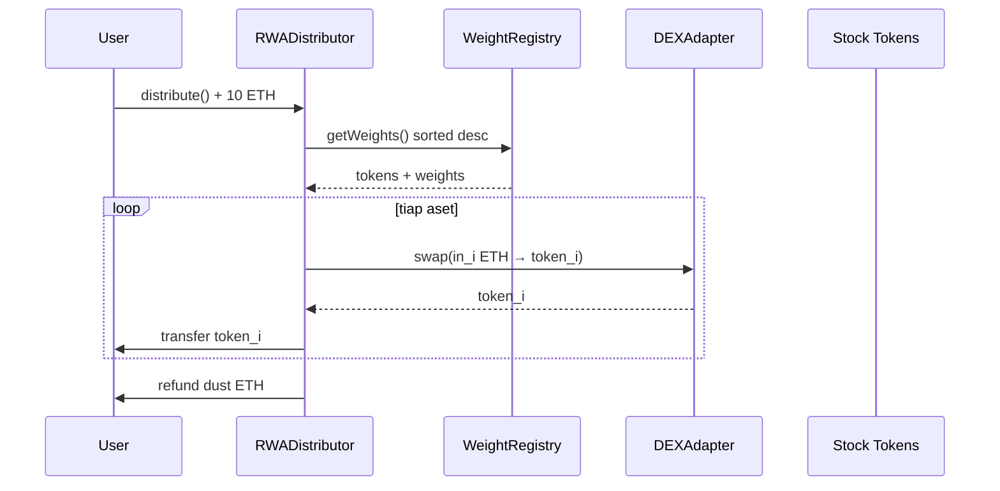

# Spec: RWA Distributor — Split Likuiditas Otomatis Berbobot

- **Tanggal:** 2026-09-06
- **Status:** Draft simpel (menggantikan vault+index-token untuk MVP)
- **Ide inti:** user deposit sekali (misal 10 ETH) → kontrak pecah otomatis ke daftar index RWA → **user langsung pegang aset rilnya**, bukan unit index. Bobot tertinggi dapat alokasi terbesar.
- **Referensi terkait:** `docs/SPEC-MAG7.md` (bagian WeightRegistry + oracle tetap dipakai), `docs/UNISWAP-V4-HOOKS-RWA.md` (tidak dipakai untuk MVP ini)

---

## 1. Konsep

```text
User kirim 10 ETH ke Distributor
  → baca weights dari WeightRegistry (sorted desc, sum = 10000 bps)
  → untuk tiap aset: amountIn_i = 10 ETH × weight_i / 10000
  → swap via DEX (Uniswap / Rialto / 0x) ETH → Stock Token_i
  → kirim Stock Token_i langsung ke wallet user
```

- **Kepemilikan:** `balanceOf(StockToken_i) = user`, bukan vault. Distributor hanya router stateless (tidak menahan dana setelah tx selesai, kecuali fee/residu).
- **Beda dengan desain vault sebelumnya:** tidak ada `RWAIndexToken`, tidak ada NAV, tidak ada mint/burn, tidak ada rebalance vault. Rebalance = user deposit lagi dengan bobot terbaru.
- **Bobot:** sama seperti desain Mag7 — dihitung off-chain dari volume 24 jam, push 24 jam sekali ke `WeightRegistry`, kontrak baca urutan sorted (bobot besar di atas → alokasi besar).

Contoh 10 ETH, weights [NVDA 2500, MSFT 1800, AAPL 1700, AMZN 1200, META 1100, GOOGL 900, TSLA 800]:

| Aset | Bobot | ETH masuk | Output ke user |
|---|---|---|---|
| NVDA | 25% | 2.5 | NVDA token senilai ~2.5 ETH |
| MSFT | 18% | 1.8 | MSFT token senilai ~1.8 ETH |
| AAPL | 17% | 1.7 | dst. |
| AMZN | 12% | 1.2 | dst. |
| META | 11% | 1.1 | dst. |
| GOOGL | 9% | 0.9 | dst. |
| TSLA | 8% | 0.8 | dst. |

---

## 2. Kontrak yang dibutuhkan (minimal)

```text
ConstituentRegistry — daftar Stock Token + aktif/nonaktif (reuse SPEC-MAG7)
WeightRegistry       — weights bps per epoch 24h, sorted desc (reuse SPEC-MAG7)
RWADistributor       — router deposit + split + swap + kirim ke user
DEXAdapter           — 1 interface ke Uniswap/Rialto/0x (swap ETH → token)
FeeCollector (opsional) — potong fee bps, kirim ke treasury
```

Tidak perlu: IndexToken, NAVOracle (penuh), Rebalancer, Hook.

Harga Chainlink tetap dipakai **hanya untuk quote/display** di frontend (`latestRoundData`, sudah termasuk `uiMultiplier`), bukan untuk settlement — settlement ikut harga DEX aktual + slippage guard.

---

## 3. Fungsi utama

```solidity
function distribute(
  uint64 minEpoch,          // bobot minimal epoch yang diterima (cegah bobot basi)
  bytes[] calldata swapData,// rute per aset (dari frontend/quoter, 1:1 dengan sortedTokens)
  uint256[] calldata minOut,// slippage guard per aset
  uint256 deadline
) external payable returns (uint256[] memory amountsOut);
```

Alur di dalam:

1. `require(msg.value > 0)`, `require(block.timestamp <= deadline)`.
2. Ambil `(tokens, weights)` dari `WeightRegistry`, cek `epoch >= minEpoch` dan `now - lastUpdate <= 26 jam`.
3. Potong fee (misal 0.2% → treasury), sisa = `totalIn`.
4. Loop tiap `i`: `in_i = totalIn × weights[i] / 10000` → swap via DEXAdapter → `amountsOut[i]`.
5. Transfer tiap output langsung ke `msg.sender`. Emit `Distributed(user, epoch, totalIn, tokens, amountsOut)`.
6. Refund residu ETH (dust/rounding) ke user. Revert total jika ada leg yang `< minOut`.

Varian hemat gas: skip leg dengan `in_i` di bawah dust threshold, dananya dikembalikan sebagai ETH refund (emit agar transparan).

---

## 4. Diagram



---

## 5. Guard & parameter awal

- **Bobot basi:** tolak jika epoch < `minEpoch` atau update > 26 jam.
- **Slippage:** `minOut` per leg dari quoter frontend, plus `deadline`.
- **Dust:** `minLegIn` (misal 0.001 ETH) — leg di bawah itu di-skip + refund.
- **Keamanan:** `ReentrancyGuard`, `Pausable`, `CEI`, allowlist venue DEX, `onlyOwner` untuk set registry/router/fee.
- **Fee:** 20 bps (0.2%) ke treasury, tunable, max cap 50 bps.
- **Halt:** jika RHJ `isTradingHalt` untuk suatu aset, frontend kecualikan dari rute; kontrak support `skipTokens[]` agar 1 aset halt tidak gagalkan semua.
- **Compliance:** sama seperti Stock Token — geoblock + disclaimer prospektus di frontend.

---

## 6. Testing di repo ini

- **Unit** (`contracts/RWADistributor.t.sol`): math split 10 ETH → 7 leg sesuai bps, rounding sum ≤ totalIn, skip dust, revert bobot basi / minOut / deadline.
- **Integrasi** (`test/RWADistributor.ts`, viem): mock WeightRegistry + mock DEXAdapter + mock Stock Tokens; deposit 10 ETH → user terima 7 token proporsional; cek refund dust; cek fee ke treasury.

---

## 7. Bukan bagian MVP ini

Index token, NAV/unit, rebalance vault otomatis, Uniswap v4 hook, management fee tahunan. Semua itu bisa ditambah nanti tanpa mengubah `WeightRegistry`.
